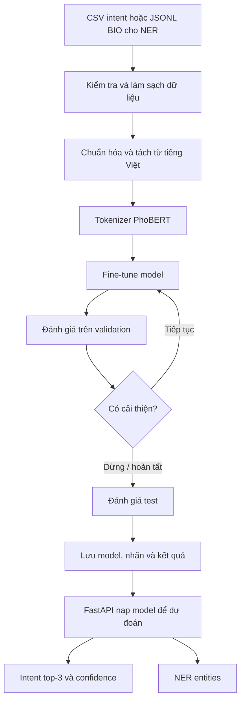

# Báo cáo quy trình AI LifeGift

## 1. Mục tiêu

AI trong dự án LifeGift xử lý ngôn ngữ tiếng Việt cho chatbot bán hàng, với hai nhiệm vụ độc lập:

- **Phân loại ý định (intent classification):** xác định khách đang muốn làm gì, ví dụ hỏi giá, kiểm tra tồn kho hoặc tra cứu đơn hàng.
- **Nhận diện thực thể (NER):** trích xuất thông tin cụ thể trong câu, ví dụ tên sản phẩm, địa điểm, số tiền, mã đơn hàng hoặc số điện thoại.

Intent và NER dùng chung mô hình nền PhoBERT nhưng có đầu ra, dữ liệu gán nhãn và model đã huấn luyện riêng.

## 2. Công nghệ

| Công nghệ | Cách dùng trong dự án |
| --- | --- |
| Python 3.11 | Ngôn ngữ viết pipeline huấn luyện và API AI. |
| PhoBERT v2 (`vinai/phobert-base-v2`) | Mô hình ngôn ngữ tiếng Việt pretrained; được fine-tune cho intent hoặc NER. |
| PyTorch | Tính toán tensor, chạy model trên CPU/GPU và huấn luyện. |
| Hugging Face Transformers | Nạp tokenizer/model, cấu hình `Trainer`, đánh giá và lưu checkpoint/model. |
| Hugging Face Datasets | Biểu diễn và biến đổi các tập dữ liệu để đưa vào `Trainer`. |
| underthesea | Chuẩn hóa theo cách tách từ tiếng Việt trước khi đưa câu vào PhoBERT. |
| pandas, NumPy | Đọc bảng CSV, xử lý dữ liệu và kết quả dự đoán. |
| scikit-learn | Mã hóa intent, tính classification report, confusion matrix và precision/recall/F1. |
| FastAPI, Uvicorn | Cung cấp REST API để backend gửi câu cần dự đoán. |

Các thư viện được khai báo trong [requirements.txt](requirements.txt). Model nền tải từ Hugging Face ở lần chạy đầu nếu chưa có trong cache; cần kết nối mạng khi đó.

## 3. Sơ đồ xử lý



## 4. Huấn luyện phân loại intent

### Dữ liệu đầu vào

Ba file CSV nằm trong `phobert_dataset/`, mỗi dòng có hai cột:

```csv
text,intent
shop hướng dẫn giúp mình cách đặt hàng với,huong_dan_dat_hang
```

Trong bộ kết quả hiện có, dữ liệu gồm 1.225 mẫu train, 320 mẫu validation, 320 mẫu test và 32 intent. Các tập cần độc lập; pipeline phát hiện câu sau tiền xử lý xuất hiện ở nhiều tập và báo lỗi data leakage.

### Các bước code

1. [phase_00_training_configuration.py](src/phase_00_training_configuration.py) khai báo model, đường dẫn dữ liệu, độ dài tối đa, learning rate, batch size, số epoch, seed và chọn CUDA nếu khả dụng.
2. [phase_01_text_preprocessing.py](src/phase_01_text_preprocessing.py) chuẩn hóa Unicode NFC, rút gọn khoảng trắng và tách từ bằng underthesea.
3. [phase_02_intent_dataset_preparation.py](src/phase_02_intent_dataset_preparation.py) đọc CSV, kiểm tra cột bắt buộc, loại dòng trống/câu trùng, kiểm tra leakage và chuyển chuỗi intent thành số bằng `LabelEncoder`.
4. [train_intent_classifier.py](train_intent_classifier.py) dùng PhoBERT tokenizer để mã hóa câu, tạo `Dataset`, rồi nạp `AutoModelForSequenceClassification` với số nhãn tương ứng.
5. Hugging Face `Trainer` fine-tune model. Cấu hình hiện tại: learning rate `2e-5`, batch train/eval `8/8`, gradient accumulation `2`, tối đa `8` epoch, weight decay `0.01`, tối đa độ dài `128`, seed `42`. Đánh giá mỗi epoch; early stopping dừng sau 2 epoch không cải thiện macro-F1. Khi bật GPU, code dùng mixed precision FP16.
6. [phase_03_intent_evaluation_metrics.py](src/phase_03_intent_evaluation_metrics.py) tính accuracy, precision, recall và F1 ở dạng weighted và macro trong quá trình đánh giá.
7. Sau khi huấn luyện, script dự đoán tập test, in classification report, tạo confusion matrix, lưu model/tokenizer tốt nhất, nhãn và biểu đồ qua [phase_04_training_results_visualization.py](src/phase_04_training_results_visualization.py).

Kết quả đang lưu trong `model/intent_classifier/metrics.json`: test accuracy **96,25%**, weighted F1 **96,17%**, macro-F1 **96,17%**. Đây là kết quả trên bộ test hiện tại, không đảm bảo tương đương trên hội thoại production.

### Lệnh chạy

Chạy trong PowerShell tại thư mục `AI`:

```powershell
.\.venv\Scripts\Activate.ps1
python train_intent_classifier.py
```

Nếu chưa tạo môi trường:

```powershell
python -m venv .venv
.\.venv\Scripts\Activate.ps1
pip install -r requirements.txt
python train_intent_classifier.py
```

## 5. Huấn luyện nhận diện thực thể NER

NER là model riêng, không phải bước tiếp nối bắt buộc của intent. Dữ liệu nằm trong `phobert_dataset/ner/` với các file `train.jsonl`, `validation.jsonl`, `test.jsonl`. Mỗi dòng chứa danh sách token và nhãn tương ứng theo định dạng BIO, ví dụ:

```json
{"tokens":["cho","tôi","cà_phê","Robusta"],"tags":["O","O","B-PRODUCT","I-PRODUCT"]}
```

`B-` đánh dấu token đầu của thực thể, `I-` đánh dấu phần tiếp theo, `O` là token không thuộc thực thể. [train_ner_model.py](train_ner_model.py) kiểm tra số lượng token/nhãn, mã hóa nhãn, chia nhãn đúng khi tokenizer tách một từ thành nhiều token con, rồi fine-tune `AutoModelForTokenClassification`.

NER hiện dùng batch size `8`, learning rate `2e-5`, tối đa `10` epoch, độ dài tối đa `128`, early stopping patience `2` và chọn model theo macro token-F1 trên validation. Cuối cùng script đánh giá test, in metric, lưu model/tokenizer ở `model/ner_model/best_model/` và lưu ánh xạ nhãn ở `model/ner_model/label_map.json`.

Chạy:

```powershell
python train_ner_model.py
```

**Giới hạn lưu kết quả:** script NER hiện in metric test ra terminal nhưng chưa lưu test report/metric JSON hay confusion matrix như pipeline intent.

## 6. Dùng model sau huấn luyện

`ai_service_api.py` nạp model intent từ `model/intent_classifier/best_model/`; `phase_05_entity_recognition_inference.py` nạp NER nếu model có sẵn. API có hai endpoint:

- `POST /predict-intent`: nhận `{"text":"..."}`, trả intent tốt nhất, confidence, top 3, câu đã tách từ và danh sách entities.
- `POST /predict-entities`: chỉ trả danh sách entities cùng trạng thái model NER có sẵn hay không.


Khởi động API từ thư mục `AI`:

```powershell
.\.venv\Scripts\Activate.ps1
python ai_service_api.py
```

API chạy mặc định tại cổng `5000`. Intent inference chia logits cho temperature `0.3` trước softmax. NER lọc entity có confidence dưới `0.5`; danh sách địa danh trong `knowledge/vietnam_locations.json` được dùng như gazetteer và được ưu tiên hơn kết quả NER cho loại `LOCATION`.

Ví dụ gọi API:

```powershell
Invoke-RestMethod -Method Post `
  -Uri http://localhost:5000/predict-intent `
  -ContentType 'application/json' `
  -Body '{"text":"cà phê Robusta ở Buôn Ma Thuột còn hàng không?"}'
```

## 7. Thư mục kết quả chính

| Đường dẫn | Nội dung |
| --- | --- |
| `model/intent_classifier/best_model/` | Model intent và tokenizer đã fine-tune. |
| `model/intent_classifier/checkpoints/` | Checkpoint trong lúc train. |
| `model/intent_classifier/metrics.json` | Metric test intent hiện được ghi trong dự án. |
| `model/intent_classifier/confusion_matrix.csv` | Ma trận nhầm lẫn giữa các intent. |
| `model/intent_classifier/charts/` | Biểu đồ loss và metric. |
| `model/ner_model/best_model/` | Model NER và tokenizer đã fine-tune. |
| `model/ner_model/label_map.json` | Ánh xạ ID nhãn NER. |

## 8. Điểm cần lưu ý

- Nên bổ sung câu thực tế từ log đã ẩn thông tin cá nhân, nhất là câu không dấu, viết tắt, sai chính tả và câu có nhiều yêu cầu.
- Theo dõi confusion matrix để biết các intent dễ nhầm; chỉ tăng dữ liệu từ các cặp nhầm có ý nghĩa.
- Với NER, chất lượng phụ thuộc mạnh vào dữ liệu BIO nhất quán và đủ ví dụ cho từng loại thực thể.
- Không dùng intent hoặc entity prediction thay cho kiểm tra tồn kho, giá, quyền truy cập hay quy tắc nghiệp vụ ở backend.
- `WARMUP_RATIO` được khai báo trong cấu hình intent nhưng script hiện truyền `warmup_steps=100` trực tiếp vào `TrainingArguments`; giá trị ratio chưa được dùng.
- Trước khi báo cáo metric mới, hãy chạy lại test sau khi huấn luyện và lưu kết quả để metric khớp với model/data hiện tại.